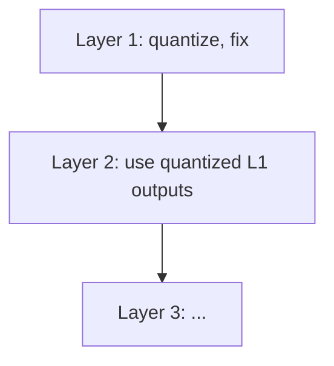

# Layer-wise Quantization

## Intuition

Quantizing all layers at once is intractable. Instead, quantize one layer at a time, minimizing output error per layer.

## Definition

A [[Quantization]] strategy that solves a reconstruction problem independently per layer.

Given layer weights $W \in \mathbb{R}^{d_{row} \times d_{col}}$ and calibration inputs $X \in \mathbb{R}^{d_{col} \times m}$:

$$\hat{W} = argmin_{\hat{W}} \|WX - \hat{W}X\|_2^2$$

Minimizes output error, not weight error directly.

### Example

Each layer sees actual inputs from the already-quantized previous layers.

## Properties

### Assumptions

- [[Quantization Grid]] fixed before optimization (min-max per row)
- Individual weights can move freely to compensate quantization error
- Rows of $W$ can be handled independently (same $X$ for all rows)

### Hessian of the objective

**Claim.** The [[Hessian Matrix]] of the layer-wise objective w.r.t. a single row $w$ is $H = 2XX^T$.

**Proof.** For one row $w \in \mathbb{R}^{d_{col}}$:

$$\mathcal{L}(w) = \|wX - \hat{w}X\|^2 = (w - \hat{w})X X^T (w - \hat{w})^T$$

Let $e = w - \hat{w}$. Then $\mathcal{L} = e\, XX^T e^T$.

$$\frac{\partial \mathcal{L}}{\partial e_i} = 2(XX^T e^T)_i, \quad \frac{\partial^2 \mathcal{L}}{\partial e_i \partial e_j} = 2(XX^T)_{ij}$$

$$\Rightarrow H = 2XX^T \in \mathbb{R}^{d_{col} \times d_{col}} \quad \blacksquare$$

$H$ depends only on inputs $X$, not on weights $\Rightarrow$ same for all rows.

See also: [[Quantization]], [[OBQ]], [[Hessian Matrix]]

#inference #quantization
