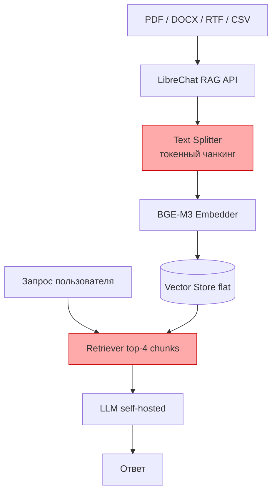
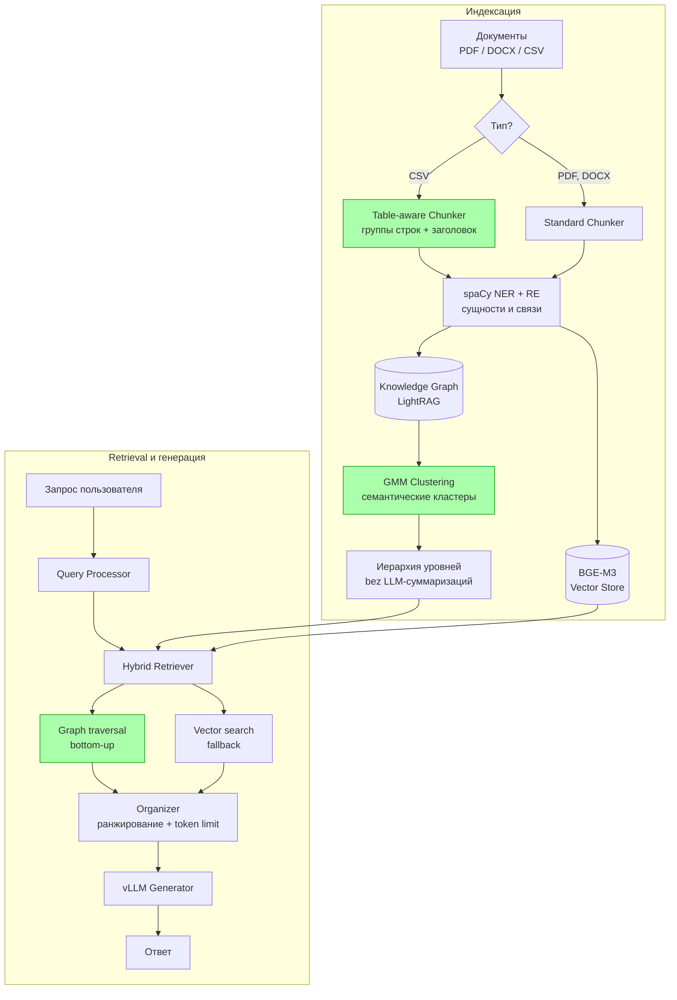
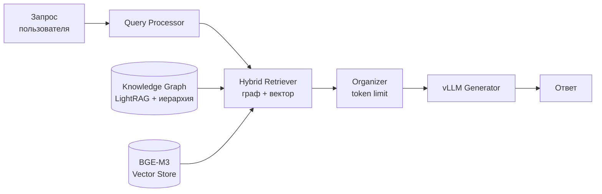
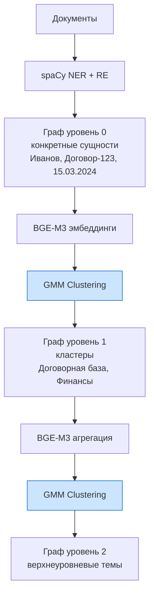
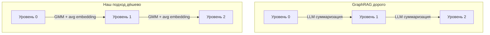

# Диаграммы архитектуры RAG

## 1. Baseline — текущая система МТС

Проблема: CSV режется по токенам → 4 строки без заголовков → нет контекста.

---

## 2. Предложенная архитектура — полный pipeline

---

## 3. Workflow запроса — упрощённая схема

---

## 4. Построение иерархии графа

Ключевое: каждый уровень — агрегация векторов (дёшево), не LLM-суммаризация (дорого).

---

## 5. Сравнение подходов к построению иерархии

