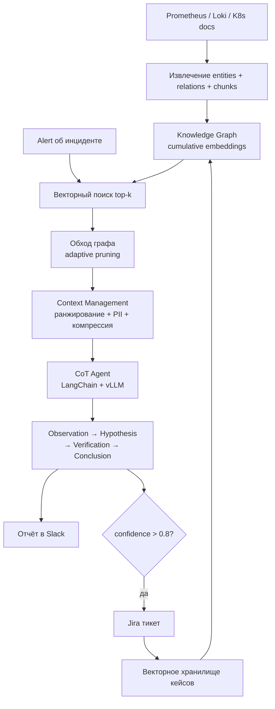
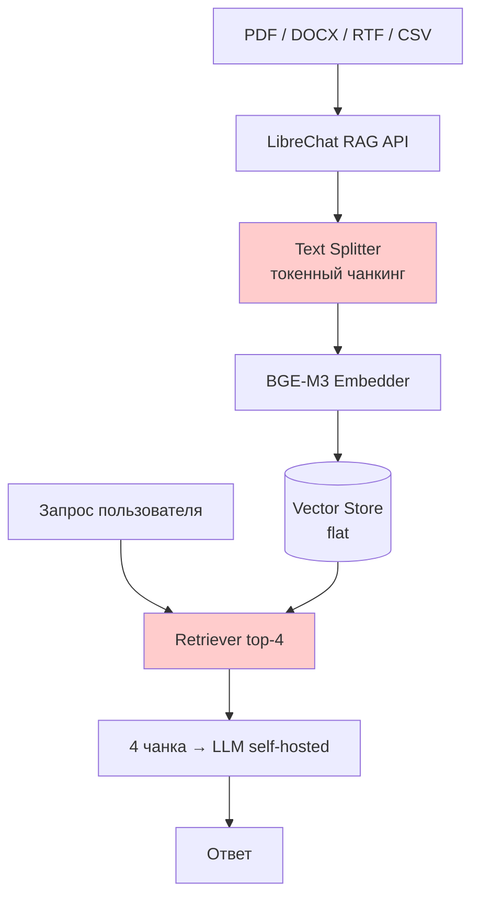
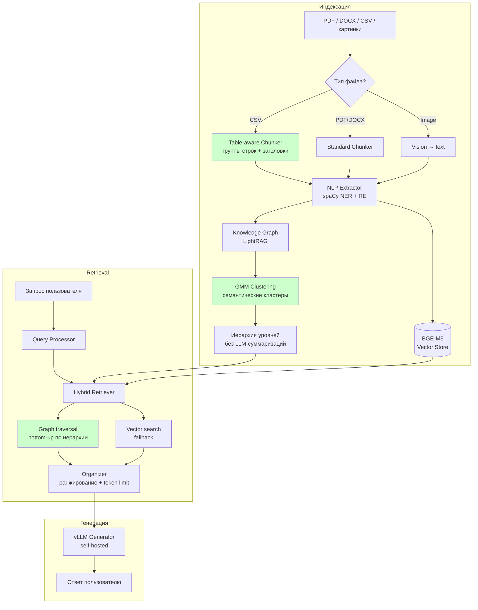
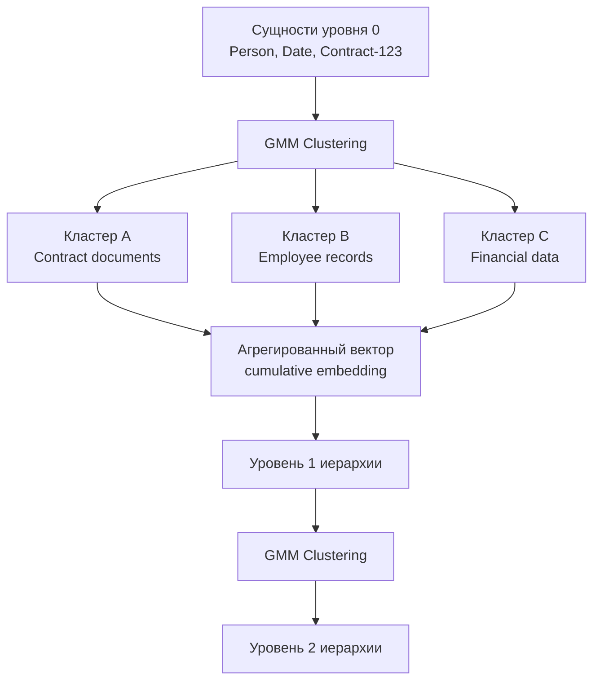

# Переработка архитектуры дипломной работы

## Почему происходит переработка

Исходная архитектура была спроектирована под задачу **анализа инцидентов в облачной инфраструктуре** (Prometheus + Loki + Kubernetes). После созвона с ментором МТС выяснилось:

| Предположение                                     | Реальность                                                     |
| ------------------------------------------------- | -------------------------------------------------------------- |
| RAG используется для анализа логов/метрик/трейсов | RAG — клиентское хранилище документов (PDF, DOCX, CSV)         |
| Есть SRE-команда, которая будет валидировать      | Нет ML-инженера, нет метрик, только удовлетворённость клиентов |
| Система строится с нуля                           | Уже работает LibreChat + BGE-M3 (flat retrieval)               |
| Предиктивный мониторинг — приоритет               | Не используется и не планируется                               |
| GraphRAG нужен МТС                                | Нет спроса, бюджетные ограничения                              |

**Реальная боль МТС:** при загрузке CSV-файла (5 МБ) retriever возвращает 4 строки — слишком мало. Полный документ не помещается в контекст модели. Промежуточного уровня нет.

**Вывод:** тема остаётся («оптимизация компонентов RAG-инфраструктуры»), но **объект меняется** — с мониторинга инцидентов на чат с документами.

---

## Было: архитектура анализа инцидентов



**Проблемы этой архитектуры:**
- Prometheus/Loki данные МТС **не предоставит** (или предоставит ограниченно)
- SRE-команды для валидации **нет**
- 50 production-инцидентов для датасета **нереалистичны** в рамках диплома
- CoT для анализа инцидентов — сложная задача с неочевидным baseline

---

## Стало: архитектура чата с документами

**Baseline (что сейчас у МТС):**



**Проблемы baseline:**
- Text Splitter режет CSV по токенам → теряет структуру строк/столбцов → 4 строки вместо контекста
- Flat vector retrieval — нет связей между сущностями из разных документов
- Нет метрик вообще

---

**Предложение (новая архитектура):**



---

## Ключевые изменения и обоснование

### 1. Table-aware Chunker для CSV

**Было:** стандартный text splitter режет по токенам → строки CSV разрываются случайно.

**Стало:** chunker понимает структуру таблицы — группирует строки, всегда включает заголовок в каждый чанк.

```
Было:                          Стало:
"John,25,Engin..."             "Name,Age,Role\nJohn,25,Engineer\nMary,30,Manager\nBob,28,Analyst"
"eer\nMary,30,M..."            "Name,Age,Role\nBob,28,Analyst\nLisa,35,Director\nTom,22,Intern"
```

Это напрямую решает главную боль МТС.

### 2. NLP-извлечение сущностей (spaCy, не LLM)

**Было (LightRAG default):** каждый чанк → LLM → извлечение entities + relations → дорого при индексации.

**Стало:** spaCy NER + Relation Extraction → дёшево, без LLM-вызовов на индексации. Граф строится бесплатно.

### 3. Иерархия через GMM кластеризацию

**Было:** нет иерархии (LightRAG flat 1-hop) **или** LLM-суммаризации каждого уровня (GraphRAG, дорого).

**Стало:** BGE-M3 эмбеддинги сущностей → GMM кластеризация → иерархия уровней без LLM. Это то, что LeanRAG (AAAI-26) предлагает, но дешевле — без генерации абстрактных сущностей через LLM.



**Почему лучше LightRAG:** настоящая иерархия вместо 1-hop.
**Почему дешевле LeanRAG:** нет LLM-вызовов для генерации абстрактных сущностей.

### 4. Hybrid Retrieval вместо flat

**Было:** только vector search top-k.

**Стало:** graph traversal bottom-up (от точных сущностей вверх по иерархии) + vector search как fallback. 46% меньше retrieval redundancy (по данным LeanRAG на схожем подходе).

### 5. Объект исследования

**Было:** Kubernetes + Prometheus + Loki (мониторинг инцидентов).

**Стало:** корпоративные документы МТС (PDF, DOCX, CSV) — это реальный работающий кейс с реальной болью.

---

## Метрики: что было vs что будет измеряться

| Метрика | Старая архитектура | Новая архитектура |
|---|---|---|
| Retrieval precision@k | vs K8sGPT, flat RAG | vs LibreChat baseline |
| MTTD / MTTR | SRE-инциденты (нереалистично) | **убрать** |
| CSV chunk coverage | нет | **добавить** — % строк CSV в контексте |
| Answer faithfulness | через SRE-опрос | LLM-judge |
| Latency | ≤ 60 сек | ≤ 5 сек (документы, не инциденты) |
| Token overhead | cumulative vs LLM summaries | spaCy vs LLM extraction |

---

## Что остаётся без изменений

- **vLLM** как inference backend для генератора — по-прежнему лучший self-hosted движок
- **LightRAG** как основа retrieval — только с оптимизациями поверх
- **BGE-M3** как эмбеддер — уже используется в МТС, continuity
- **Тема диплома** — «оптимизация компонентов RAG-инфраструктуры» — по-прежнему корректна
- **Обзор литературы** — GraphRAG, LightRAG, HippoRAG, LeanRAG (добавить)

---

## Что делать дальше

- [ ] Изучить как LibreChat делает chunking CSV (исходный код RAG API)
- [ ] Реализовать table-aware chunker (Python + pandas)
- [ ] Настроить spaCy pipeline для NER + RE на корпоративных документах
- [ ] Реализовать GMM кластеризацию поверх LightRAG графа
- [ ] Построить hybrid retriever (граф + вектор)
- [ ] Добавить LeanRAG в обзор литературы
- [ ] Переписать слайды 2, 4, 5, 6, 7 под новую архитектуру

#diploma #mts #architecture #refactoring
