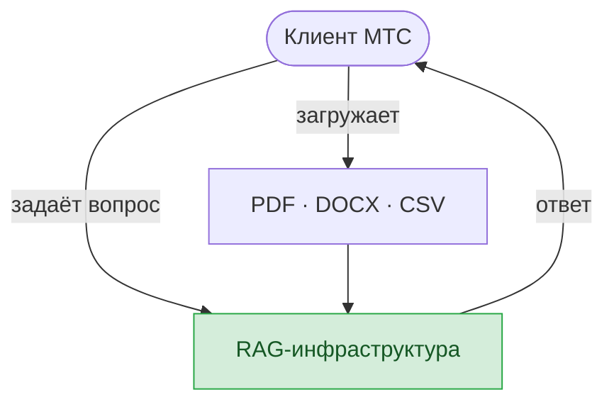
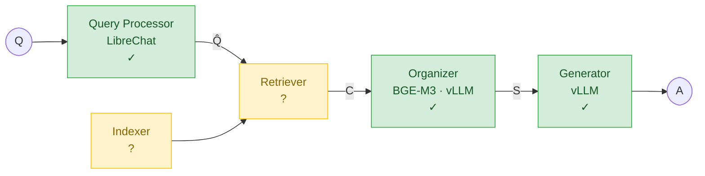
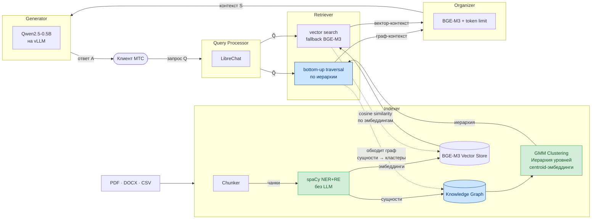

Перепиши текст к презентации дипломной работы. Тема остаётся:
"Применение и оптимизация компонентов RAG-инфраструктуры для аналитики в облачных средах"

━━━ КОНТЕКСТ ━━━

Объект исследования изменился после созвона с ментором МТС.

Было: анализ инцидентов в облачной инфраструктуре (Prometheus, Loki, Kubernetes, SRE-команда).
Стало: чат с документами для бизнес-аналитики клиентов МТС (PDF, DOCX, CSV).

Реальная ситуация:
- У МТС уже работает LibreChat + BGE-M3 (flat vector retrieval) — это baseline.
- Клиенты загружают документы (договора, отчёты, CSV с данными) и задают вопросы.
- Главная боль: плоский поиск теряет связи между сущностями из разных документов.
- Метрики не измеряются вообще. Только удовлетворённость клиентов.
- GraphRAG в производстве нет и не планируется — нет спроса и бюджета.
- Ментор предложил сделать отдельный прототип сервиса "общение с документами".

"Аналитика в облачных средах" = клиенты МТС анализируют свои бизнес-документы через облачный сервис.

━━━ НОВЫЕ ТЕКСТЫ СЛАЙДОВ ━━━

───────────────────────────────
СЛАЙД 2: Актуальность
───────────────────────────────

*Рис. 1. Сценарий использования RAG-инфраструктуры клиентом МТС.*

Клиенты МТС анализируют корпоративные документы в облаке — договора, отчёты и таблицы в форматах PDF, DOCX и CSV. Объём данных растёт, ручной поиск не справляется.

LLM читают неструктурированный текст, но ограничены размером контекста. RAG-инфраструктура решает это, извлекая релевантные фрагменты из базы документов и передавая их в LLM для генерации ответа.

Существующие RAG-инфраструктуры либо дают неудовлетворительное качество ответов на больших корпусах, либо требуют высокой стоимости индексации.

───────────────────────────────
СЛАЙД 3: Компоненты RAG и обзор существующих решений
───────────────────────────────

*Рис. 2. Компоненты RAG-пайплайна.*

Открытый вопрос — какой Retriever и Indexer обеспечат наилучшее качество ответов при минимальной стоимости индексации и запросов.

| Метрика (Mix)                                | NaiveRAG |  LightRAG   |         GraphRAG          |         LeanRAG          |
| -------------------------------------------- | :------: | :---------: | :-----------------------: | :----------------------: |
| Comprehensiveness — полнота покрытия вопроса |   8.20   |    8.19     |           8.52            |         **8.89**         |
| Empowerment — практическая полезность ответа |   7.52   |    7.56     |           7.73            |         **8.16**         |
| Diversity — широта охваченных перспектив     |   6.65   |    6.69     |           7.04            |         **7.73**         |
| Overall — итоговая оценка                    |   7.47   |    7.61     |           7.87            |         **8.59**         |
| Retrieved context, млн токенов               |    —     |     3.7     |            1.5            |         **0.9**          |
| Init — LLM-вызовов при индексации            |   нет    | O(N_chunks) | O(N_chunks + N_community) | O(N_chunks + K_clusters) |

*Таблица 1. Сравнение RAG-методов по качеству и стоимости (датасет смешанных документов разных доменов).*

DeepSeek-V3 выставлял метрики качества по шкале 1–10, по 5 независимых оценок на каждый ответ.***

**Gap:** LeanRAG даёт лучшее качество и наименьший retrieved context, но LLM вызывается на каждом уровне иерархии, что дорого при индексации больших корпусов.

**Решение:** оптимизировать LeanRAG, заменить LLM-вызовы на этапе индексации:
spaCy NER+RE вместо LLM-извлечения сущностей + embedding-центроиды кластеров вместо LLM-суммаризации.

───────────────────────────────
СЛАЙД 4: Цели и задачи
───────────────────────────────
Цель: спроектировать, реализовать и оптимизировать компоненты RAG-инфраструктуры для аналитики корпоративных документов в облачных средах на основе модификации LeanRAG с устранением LLM-вызовов на этапе индексации.

Задачи:
1. Реализовать базовый прототип RAG-инфраструктуры, где Query Processor реализован на основе LibreChat, Organizer на основе BGE-M3, Generator на основе инференса Qwen2.5-0.5B на vLLM, Retriever и Indexer на основе flat vector search.
2. Внедрить LeanRAG в качестве Retriever и Indexer, заменив плоский поиск на граф знаний с иерархическим retrieval.
3. Оптимизировать LeanRAG, заменив LLM-извлечение сущностей на spaCy NER+RE и LLM-суммаризацию кластеров на embedding-центроиды.
4. Провести сравнительную оценку по метрикам Comprehensiveness, Empowerment, Diversity, Overall, recall@k и latency.

───────────────────────────────
СЛАЙД 5: Объект, предмет, методы
───────────────────────────────
- Объект:
- облачный сервис для работы с корпоративными документами (PDF, DOCX, CSV).
- Предмет:

- компоненты RAG-инфраструктуры на базе LeanRAG, включающие Indexer (NER/RE, граф, GMM-иерархия) и Retriever (bottom-up hybrid).

- Методы исследования:

- (1) аналитический обзор GraphRAG, LightRAG и LeanRAG с выявлением gap в качестве и стоимости индексации;

- (2) анализ кода LeanRAG с локализацией LLM-вызовов при построении иерархии;

- (3) реализация модификации в Python с заменой LLM на spaCy NER+RE и embedding-центроиды;

- (4) сравнительное тестирование прототипа и baseline по метрикам Comprehensiveness, Empowerment, Diversity, Overall, recall@k и latency.
───────────────────────────────
СЛАЙД 6: Постановка задачи прототипа
───────────────────────────────
[Диаграмма RAG_Workflow_Simple.puml]

*Рис. 3. Постановка задачи прототипа на основе модификации LeanRAG.*

Прототип должен превысить baseline по всем метрикам качества ответа при latency не более 5 сек.

───────────────────────────────
СЛАЙД 7: Архитектура решения
───────────────────────────────

*Рис. 4. Архитектура модификации LeanRAG для корпоративных документов. Зелёный — оптимизация LeanRAG, синий — компонент LeanRAG без изменений, розовый — другие компоненты.*

───────────────────────────────
СЛАЙД 8: План экспериментальной оценки
───────────────────────────────
Датасет — корпоративные документы (PDF, DOCX, CSV) с синтетическими вопросами и эталонными ответами.

Baseline для сравнения — LibreChat + BGE-M3 + flat vector retrieval (текущее состояние МТС).

Метрики качества ответа оцениваются LLM-judge (DeepSeek-V3) по шкале 1–10:
- Comprehensiveness — полнота покрытия вопроса
- Empowerment — практическая полезность ответа
- Diversity — широта охваченных перспектив
- Overall — итоговая оценка

Метрики retrieval и производительности:
- retrieval recall@k — доля релевантных чанков среди top-k извлечённых
- end-to-end latency в мс от запроса до ответа

Этапы: реализация, индексация, синтетические Q&A, оценка относительно baseline.

───────────────────────────────
СЛАЙД 9: Ожидаемый практический эффект
───────────────────────────────
Технические улучшения относительно flat retrieval baseline:
- Recall@k выше, так как иерархия связывает сущности из разных документов, которые flat search теряет.
- Comprehensiveness, Empowerment, Diversity и Overall выше за счёт компактного retrieved context (0.9М токенов по датасету Mix).
- LLM-вызовы при индексации устранены заменой NER+RE на spaCy и суммаризации кластеров на centroid-эмбеддинги.
- Latency не более 5 сек.

Прикладной эффект:
- Объективные метрики качества вместо субъективной удовлетворённости клиентов.
- Прозрачный retrieval с видимостью того, из каких сущностей и кластеров собран контекст.
- Прототип совместим с LibreChat как drop-in замена Retriever.

───────────────────────────────
СЛАЙД 10: Заключение
───────────────────────────────
Что сделано:
1. Выявлен gap: LeanRAG даёт лучшее качество и наименьший retrieved context, но LLM вызывается на каждом уровне иерархии.
2. Предложена оптимизация LeanRAG: spaCy NER+RE вместо LLM-извлечения сущностей и embedding-центроиды вместо LLM-суммаризации кластеров.
3. Иерархия и bottom-up retrieval LeanRAG сохранены без изменений.
4. Определены метрики и baseline: Comprehensiveness, Empowerment, Diversity, Overall, recall@k и latency относительно flat retrieval.

Следующие шаги:
- реализация модификации LeanRAG с заменой LLM на spaCy и centroid-эмбеддинги
- экспериментальная оценка относительно baseline

Спасибо за внимание!

───────────────────────────────
СЛАЙД 11: Реальный кейс — МТС
───────────────────────────────
Текущее состояние:
- LibreChat + BGE-M3, flat vector retrieval без иерархии.
- Клиенты загружают PDF, DOCX, CSV и задают вопросы на естественном языке.
- Метрики не измеряются, оценка качества через субъективную удовлетворённость клиентов.

Плоский retriever теряет связи между сущностями из разных документов и не даёт видимости в то, что именно извлекается.

Что даёт прототип:
- drop-in замена Retriever, совместимая с LibreChat без изменения интерфейса.
- recall@k, faithfulness и latency вместо субъективного «нравится / не нравится».
- иерархический граф для ответов на вопросы, требующих синтеза из нескольких документов.

━━━ СПИСОК ЛИТЕРАТУРЫ ━━━

1. Lewis P. et al. Retrieval-Augmented Generation for Knowledge-Intensive NLP Tasks // arXiv:2005.11401. — 2020.
2. Edge D. et al. From Local to Global: A Graph RAG Approach to Query-Focused Summarization // arXiv:2404.16130. — 2024.
3. Guo Z. et al. LightRAG: Simple and Fast Retrieval-Augmented Generation // arXiv:2410.05779. — 2024.
4. Zhang Y. et al. LeanRAG: Knowledge-Graph-Based Generation with Semantic Aggregation and Hierarchical Retrieval // arXiv:2508.10391. — 2025. (AAAI-26)
5. Chen J. et al. BGE M3-Embedding: Multi-Lingual, Multi-Functionality, Multi-Granularity Text Embeddings Through Self-Knowledge Distillation // arXiv:2402.03216. — 2024.
6. Kwon W. et al. Efficient Memory Management for Large Language Model Serving with PagedAttention // SOSP '23. — 2023.
7. Explosion AI. spaCy: Industrial-strength Natural Language Processing // spacy.io. — 2023.
