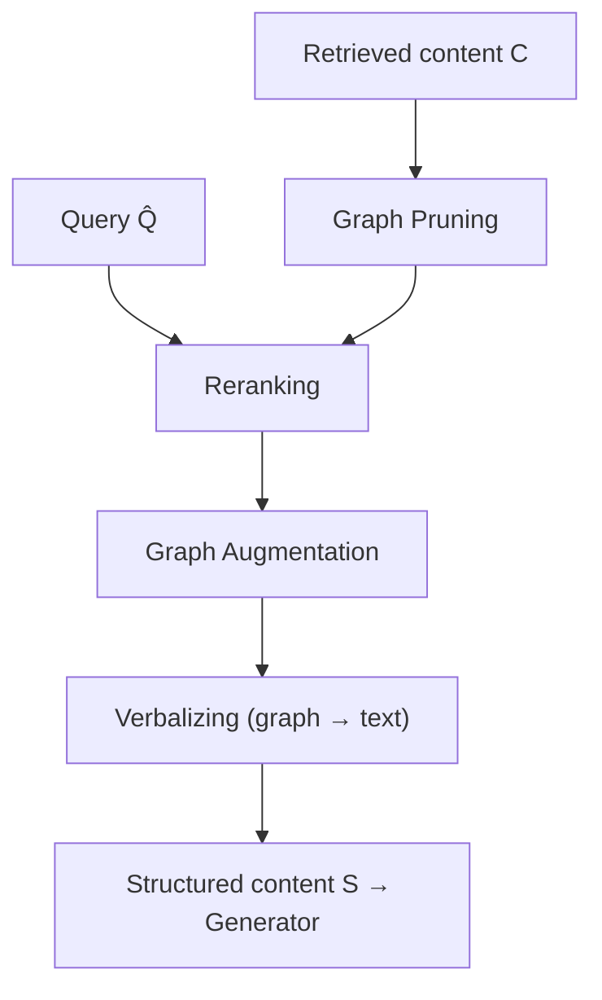

# Organizer $\Omega^{Organizer}$

Refine retrieved content $C$ into structured content $S$ for [[Generator]].

$$S = \Omega^{Organizer}(\hat{Q}, C)$$

> Takes both query $\hat{Q}$ and content $C$ — task-aware refinement.

## Input / Output

- **Input:** $\hat{Q}$ (from [[Query Processor]]), $C$ (from [[Retriever]])
- **Output:** $S$ — structured content for [[Generator]]

## Methods

| Method | What it does |
|--------|--------------|
| **Graph Pruning** | Remove irrelevant nodes/edges from $C$ |
| **Reranking** | Reorder by semantic relevance or structural importance |
| **Graph Augmentation** | Enrich $C$ with additional context |
| **Verbalizing** | Convert graph structure → natural language text |

## Graph Structures

| Structure | Description | Papers |
|-----------|-------------|--------|
| Flat KG | Simple [[Graph]] | LightRAG |
| Community hierarchy | Leiden/Louvain clustering | GraphRAG |
| Temporal KG | Time-aware | T-GRAG |

## Pipeline

See also: [[GraphRAG query process]], [[Retriever]], [[Generator]], [[Graph]]
