# Structured Reasoning

Structure [[Query]] $Q$ as an iterative reasoning graph instead of a DB query.

$$Q \xrightarrow{\text{LLM}} KG_{thoughts}$$

## Core idea (KGoT)

LLM builds a KG dynamically from its own reasoning + tool outputs.

```mermaid
graph TD
    Q["Query Q"] --> Vote{"Majority vote: enough info?"}
    Vote -->|No| Enhance["Enhance: LLM calls tools"]
    Enhance --> Triples["New triples → KG"]
    Triples --> Vote
    Vote -->|Yes| Solve["Solve: extract answer from KG"]
    Solve --> A["Answer"]
```

## Two LLM roles

| Role | What it does |
|------|-------------|
| **Graph Executor** | Identifies missing info, formulates KG queries |
| **Tool Executor** | Selects and invokes tools (web, python, APIs) |

## Answer extraction

| Method | When |
|--------|------|
| Cypher/SPARQL | Pattern matching |
| Python (NetworkX) | Complex traversal |
| Full KG in context | Small graph |

## vs [[Structured Query Language]]

| | Structured Query | Structured Reasoning |
|-|------------------|---------------------|
| Output | DB query | Growing KG |
| KG | Pre-built | Built on-the-fly |
| Tools | None | Web, Python, APIs |
| Multi-step | No | Yes (iterative) |

See also: [[Query Structuration]], [[KGoT]], [[Structured Query Language]]

#query-processing #reasoning
