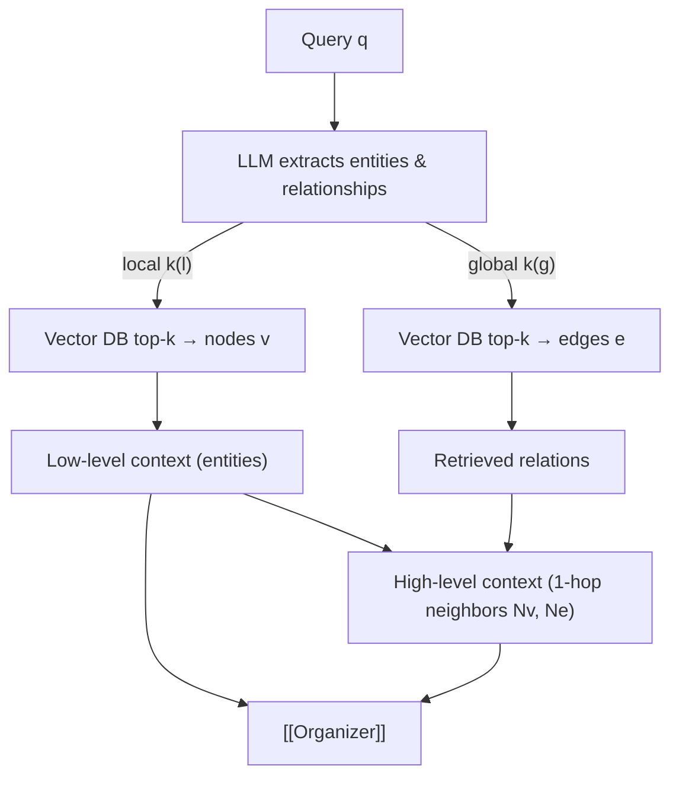

# LightRAG Query — Dual-level Retrieval $\psi(\cdot)$

## Given

- [[Query]] $q$
- Indexed data $\hat{D} = (G, K')$ from [[LightRAG Init]]

## Keyword Extraction

LLM extracts from $q$:

| Keywords | Match against | Retrieves |
|----------|---------------|-----------|
| Local $k^{(l)}$ | Entity keys in Vector DB | Nodes $v$ |
| Global $k^{(g)}$ | Relation keys in Vector DB | Edges $e$ |

## Low-level and High-level Context

**Low-level context** (lexical) — entities retrieved by [[Vector Similarity]] top-k.

**High-level context** (semantic) — 1-hop neighbors of retrieved nodes and edges:

$$H = \{v_i \mid v_i \in V \land (v_i \in N_v \lor v_i \in N_e)\}$$

> [[Is High Context in LightRAG real High|Question]]: Is High Context in LightRAG real High? Are all neighbors really needed? Can they be pruned?

## Pipeline

## Retrieval Modes

| Mode | Retrieves |
|------|-----------|
| Low-level | Entities + attributes |
| High-level | Themes + neighbor relations |
| Hybrid | Both |

## Complexity

Vector search over entities/relations instead of chunks → lower retrieval overhead than community-based traversal (GraphRAG).

See also: [[LightRAG Init]], [[Profiling (Key–Value Gen.)]], [[Retriever]]

#lightrag #retrieval
